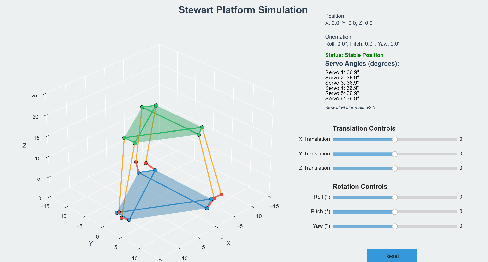

# Stewart Platform Simulation



## Overview

The Stewart Platform Simulation is an interactive 3D visualization tool that models a 6-DOF (Degrees of Freedom) parallel manipulator. This application allows users to dynamically adjust the position and orientation of a simulated Stewart platform while visualizing the resulting servo angles and platform configuration in real-time.

## Features

- **Interactive 3D Visualization**: Real-time rendering of the Stewart platform with color-coded components for clear identification.
- **Dynamic Control**: Adjust platform position (X, Y, Z) and orientation (roll, pitch, yaw) using intuitive sliders.
- **Real-time Analysis**: Instant feedback on servo angles and platform stability.
- **Modern User Interface**: Clean, well-organized GUI with appropriate spacing and grouping of related controls.
- **Stability Detection**: Automatic detection and warning for unreachable configurations.
- **Reset Functionality**: One-click reset to default platform position.

## Installation

### Prerequisites

- Python 3.7+
- NumPy
- Matplotlib (with 3D toolkit)

### Setup

1. Clone the repository:
   ```bash
   git clone https://github.com/username/stewart-platform-sim.git
   cd stewart-platform-sim
   ```

2. Install required dependencies:
   ```bash
   pip install -r requirements.txt
   ```

## Usage

1. Run the simulation:
   ```bash
   python stewart_platform_sim.py
   ```

2. Use the sliders on the right side to control:
   - **Translation**: Move the platform along X, Y, and Z axes
   - **Rotation**: Adjust roll, pitch, and yaw angles

3. The information panel in the upper-right corner displays:
   - Current servo angles
   - Platform position and orientation
   - Stability status

4. Click the "Reset" button to return the platform to its default position.

## Technical Details

### Stewart Platform Mechanism

The Stewart platform (also known as a hexapod) is a type of parallel manipulator that uses six prismatic actuators. These actuators connect a fixed base to a movable platform, allowing for motion with six degrees of freedom (three translational and three rotational).

### Implementation

#### Coordinate Systems

- **Base Platform**: Fixed at Z=0, with servo attachment points arranged in a hexagon
- **Top Platform**: Mobile platform that can be positioned and oriented freely
- **Global Coordinates**: Origin at the center of the base with Z-up convention

#### Mathematical Model

The simulation uses forward and inverse kinematics to:

1. Calculate servo angles based on desired platform position and orientation
2. Detect unreachable configurations
3. Visualize the resulting mechanical arrangement

#### Key Calculations

```python
def calculate_stewart_platform(r_B, r_P, servo_arm_length, rod_length, alpha_B, alpha_P, trans, orient):
    """
    Calculate servo angles for given platform parameters and desired position
    
    Parameters:
    - r_B: radius of base platform
    - r_P: radius of top platform
    - servo_arm_length: length of servo arms
    - rod_length: length of connecting rods
    - alpha_B: angle offset for base joints (radians)
    - alpha_P: angle offset for platform joints (radians)
    - trans: [x, y, z] translation vector
    - orient: [roll, pitch, yaw] orientation in radians
    
    Returns:
    - servo angles in radians
    """
```

### Visualization

The simulation leverages Matplotlib's 3D capabilities to render:

- Base platform (blue hexagon)
- Mobile platform (green hexagon)
- Servo arms (red segments)
- Connecting rods (orange segments)
- Joint connections (spheres)

## Configuration Parameters

The Stewart platform's geometric parameters can be modified in the code:

| Parameter | Default Value | Description |
|-----------|---------------|-------------|
| r_B | 10.0 | Radius of base platform |
| r_P | 8.0 | Radius of top platform |
| servo_arm_length | 2.5 | Length of servo arms |
| rod_length | 15.0 | Length of connecting rods |
| alpha_B | 10° | Angle offset for base joints |
| alpha_P | 10° | Angle offset for platform joints |

## Limitations and Constraints

- **Mechanical Constraints**: The platform cannot reach configurations where servo angles become complex numbers.
- **Visualization**: Limited to static rendering (not real-time physics simulation).
- **Performance**: May slow down on older hardware due to 3D rendering.

## Advanced Usage

### Custom Platform Geometry

To customize the platform's geometry, modify the following parameters in the `__init__` method of the `StewartPlatform` class:

```python
# Default geometry parameters
self.r_B = 10.0
self.r_P = 8.0
self.servo_arm_length = 2.5
self.rod_length = 15.0
self.alpha_B = np.radians(10)
self.alpha_P = np.radians(10)
```

### Custom Color Scheme

The visualization colors can be customized by modifying:

```python
# Color scheme
self.base_color = '#3498db'  # Blue
self.platform_color = '#2ecc71'  # Green
self.servo_color = '#e74c3c'  # Red
self.rod_color = '#f39c12'  # Orange
self.axis_color = '#7f8c8d'  # Gray
self.background_color = '#ecf0f1'  # Light gray
self.text_color = '#2c3e50'  # Dark blue
```

## Troubleshooting

### Common Issues

1. **"Unreachable" Status**: Occurs when:
   - Translation exceeds the mechanical limits of the platform
   - Rotation angles are too extreme
   - Solution: Reduce translation/rotation values or increase rod length

2. **Slow Performance**:
   - Solution: Reduce the figure size or update frequency

3. **Matplotlib Errors**:
   - Ensure you have the latest version of Matplotlib
   - Install the required 3D toolkit: `pip install matplotlib`

## Mathematical Background

### Inverse Kinematics

The simulation solves the inverse kinematics problem to determine servo angles:

1. Calculate top platform position using rotation matrix and translation
2. For each servo:
   - Compute vector from servo base to platform attachment point
   - Project this vector onto XY plane
   - Calculate servo angle using trigonometry (law of cosines)
   - Mark configuration as unreachable if no valid angle exists

### Rotation Matrix

Rotation is computed using the standard 3D rotation matrix:

```python
def rotation_matrix(roll, pitch, yaw):
    """Calculate rotation matrix from roll, pitch, yaw angles (in radians)"""
    Rx = np.array([[1, 0, 0],
                  [0, np.cos(roll), -np.sin(roll)],
                  [0, np.sin(roll), np.cos(roll)]])

    Ry = np.array([[np.cos(pitch), 0, np.sin(pitch)],
                  [0, 1, 0],
                  [-np.sin(pitch), 0, np.cos(pitch)]])

    Rz = np.array([[np.cos(yaw), -np.sin(yaw), 0],
                  [np.sin(yaw), np.cos(yaw), 0],
                  [0, 0, 1]])

    return Rz @ Ry @ Rx  # Matrix multiplication
```

## Acknowledgments

- This simulation is based on the mechanical principles of the Stewart Platform, first described by D. Stewart in 1965.
- The visualization uses the Matplotlib library for Python.
- Special thanks to the robotics community for ongoing research in parallel manipulators.
